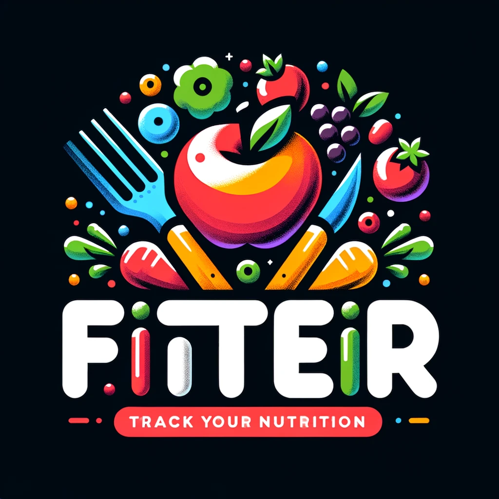

# Fitter

  

####Hi, welcome to fitter  
Fitter is a Deep Learning created to recognize the type of food and its nutritional value. This is a collaborative project developed for Machine Learning course's final project

You can check the deployment in here:
`<link>` : <https://fitterdemo.streamlit.app/>

You can see the application details including requirement, user flows on this presentation
`<link>` : [Links](https://www.canva.com/design/DAGHtH1JF3Q/SJk5CphxYdk0POC2M_uEPw/edit?utm_content=DAGHtH1JF3Q&utm_campaign=designshare&utm_medium=link2&utm_source=sharebutton)

Made By 
2602057186	TIFFANY JOYCELYN
2602069766	ALVRIAN TIMOTIUS HINANDRA
2602072760	VINCENTIA CATHERINEF
